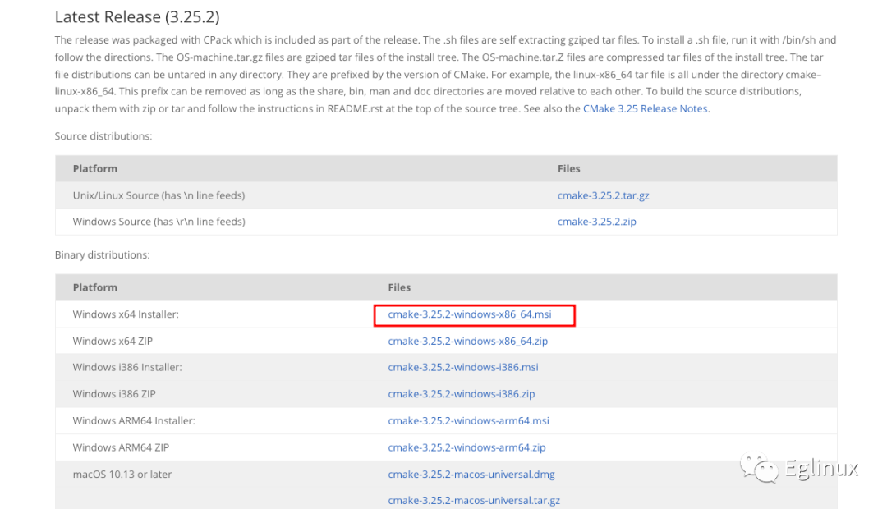
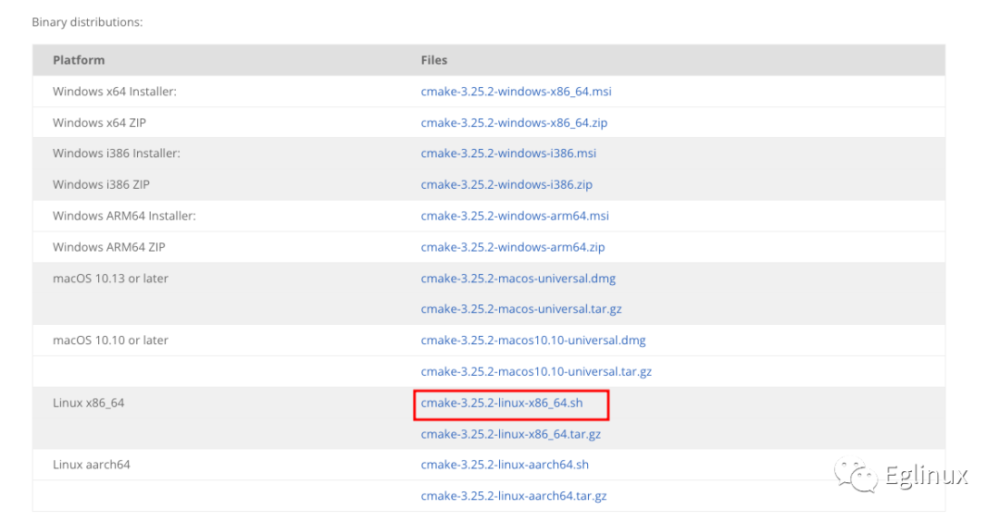
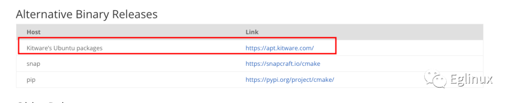

# 第 000 讲：工欲善其事必先利其器：CMake 最佳安装方法

- [第 000 讲：工欲善其事必先利其器：CMake 最佳安装方法](#第-000-讲工欲善其事必先利其器cmake-最佳安装方法)
  - [1、Windows 系统](#1windows-系统)
  - [2、Linux 系统](#2linux-系统)
  - [3、macOS 系统](#3macos-系统)


为什么会有这篇文章？其实安装 CMake 我想每个朋友都会，我想说的是怎么正确的安装 CMake 的最新版本。

为什么要安装最新版本？CMake 在不断地发展，版本更新也很快，特别是 CMake 3.0 开始开启了现代 CMake 时代。如果现在要使用 CMake 去管理一个 C/C++ 项目的编译构建等，那我强烈建议使用 CMake 的最新版本，因为旧版本的一些非常迷惑的行为在新版本得到更人性化的更改。也更符合我们的预期。

既然要讲 CMake 怎么安装，那当然是要找到最好的安装方式，便于后续的升级和使用。

我分 Windows、Linux、macOS 三种系统来分别讲解最佳安装方式。

## 1、Windows 系统

Windows 系统上没有特别好用的包管理工具，不像 Linux 和 macOS 上那样，都有非常好用包管理工具，直接可以使用命令行安装软件。

而且对于 Windows 用户来说，都不太习惯使用命令行去安装软件。所以在 Windows 平台安装 CMake，我的建议是直接到 CMake 官网找到 Windows 平台的 msi 安装包下载进行安装。这种方式有个弊端就是 CMake 有新版本还需要手动去下载新版本进行安装。

例如：64 为 x86 操作系统可以下载下图红色方框所示的 msi 安装包：



当然，对于习惯使用命令行安装软件的朋友来说，Windows 的 winget 包管理工具也是非常棒的，只需要安装 winget，然后使用下面的命令进行 CMake 最新版本的安装：

```shell
winget install -e --id Kitware.CMake
```

后续升级 CMake 就可以使用 winget 的 upgrade 子命令进行了，这是非常方便的。

## 2、Linux 系统

Linux 操作系统比较复杂，不同的发行版本有不同的包管理工具，但是部分包管理工具的 CMake 版本通常不是最新的版本。

CMake 官网虽然提供了一个 shell 脚本和应用程序一体的程序用于 Linux 系统安装 CMake。但是这种安装方式没有提供卸载方式，特别是涉及升级 CMake 的时候，如果前后两次安装没有使用相同的 prefix，那就导致系统中有两个版本的 CMake。所以新手不要使用这种方式安装。



对于发行版本使用 apt 作为包管理工具的 Linux 系统，我强烈建议使用 CMake 官方的 DEB 源进行安装，这样能确保可以使用 apt 安装到最新的 CMake 版本，还能使用 apt 对 CMake 进行升级。



如上图红框所示，可以在 CMake 官网找到。

如果包管理工具不是 apt，那可以看看是否支持 snap 包管理，如果支持，那可以使用下面的命令进行 CMake 的安装：
```shell
sudo snap install cmake --classic
```
使用 snap 安装还有一个好处，会自动更新新版本。

如果 snap 也不支持，那可以考虑使用 python 的 pip 进行安装，但是这个又️需要先安装 pip：

```shell
pip install cmake
```
但是大多数主流的 Linux 发行版本，apt 和 snap 至少有一个是支持的，或者都支持。

## 3、macOS 系统

macOS 系统上最简单，相信使用 macOS 系统的程序员都知道 brew，我就不说怎么安装 brew 了。有了 brew，就可以使用下面的命令在 macOS 系统上轻松安装最新版本的 CMake 了，同时 brew 也支持更新它管理的软件包。

```shell
brew install cmake
```
到这里，CMake 在 Windows、Linux、macOS 三个系统上的最佳安装姿势已经介绍完了。本文只讲解了安装方法，没有介绍具体的安装步骤，所以希望对 CMake 感兴趣想要学习 CMake 的朋友一定要动手亲自在你使用的系统上安装一遍 CMake。

如果你还想试试在不同的操作系统上安装 CMake，那不妨在虚拟机中试试。